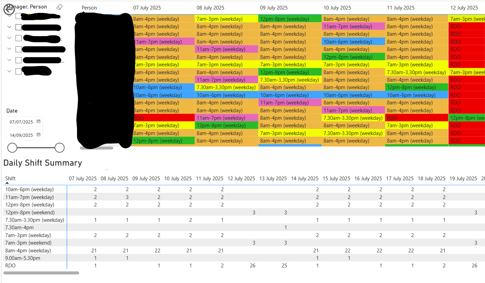
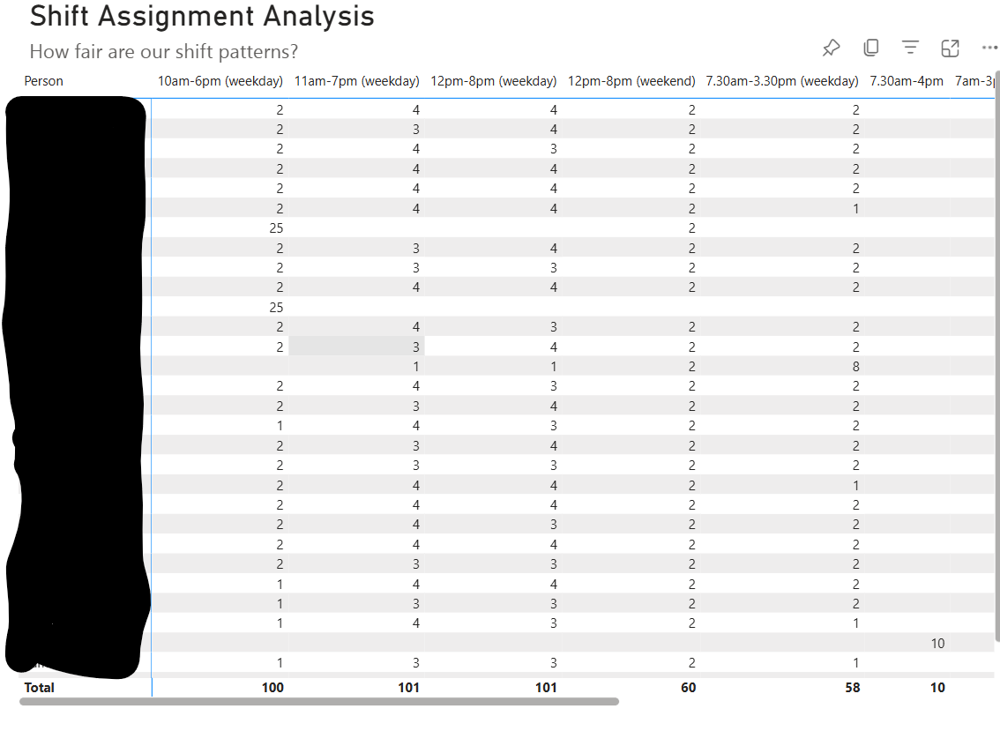

# Rota Automation with Python, Power BI, and Power Platform

> **Project Type:** Scheduling Automation and Dashboarding  
> **Tools Used:** Python, Excel, Power BI, Power Automate, Power Apps

---

## Overview

This project automates staff rota generation using Python and integrates it with the Microsoft Power Platform for seamless distribution and reporting. The solution replaces a manual process that previously required significant manager time and effort, saving approximately **0.7 FTE**. It supports fair shift distribution, weekend coverage, and flexible holiday input.

The rota is created based on key constraints and delivered as an Excel file. It’s then visualised in **Power BI** and surfaced via **Power Apps** to make it easily accessible to staff and managers.

---

## Workflow

1. **Trigger**: Rota generation starts via Power Automate (either manually or through uploaded holiday data).
2. **Azure Function Call**: Sends holiday and staff inputs to a hosted Python rota generator.
3. **Rota Creation**: Python logic calculates shift assignments while balancing fairness, rest days, and skill needs.
4. **Export**: The result is sent back as JSON and converted to Excel by Power Automate.
5. **Visualisation**: Power BI pulls from Excel to build rota dashboards.
6. **Access**: Dashboards are embedded in Power Apps for easy team-wide access.

---

## File Structure

```
Rota-Automation/
├── Complex Rota Solution.ipynb         # Python logic for rota scheduling
├── rota_data.xlsx                      # Output data from code
└── Visuals/                            # Visual outputs (Power BI)
    ├── dashboard_screenshot_1.png     # Dashboard view 1
    ├── dashboard_screenshot_2.png     # Dashboard view 2
    └── rota.xlsx                       # Excel output converted into visual rota solution
```
    
---

## 📷 Visuals

> *(Sample screenshots only – live dashboards are sensitive)*

### Rota Dashboard View  



### Rota Output Sample  


---

## Key Features

- **Automated rota generation** – handles custom business constraints (fairness, weekends, rest days).
- **Power BI dashboard** – visualises shifts per person and per day, making planning transparent.
- **Power Platform integration** – built for real-time updates via Power Automate and Power Apps.
- **Reusable and scalable** – can adapt to other departments or rota rules.

---

## Business Impact

- Saved ~0.7 FTE of manual effort  
- Improved shift fairness and visibility  
- Enabled repeatable, auditable rota generation  
- Encouraged data-led, automated planning processes

---

## What I Learned

- Writing robust, rule-based scheduling logic in Python
- Designing Excel-compatible JSON workflows for Power Automate
- Visualising operational data effectively in Power BI
- Building tools that support actual users with clear time-saving results
